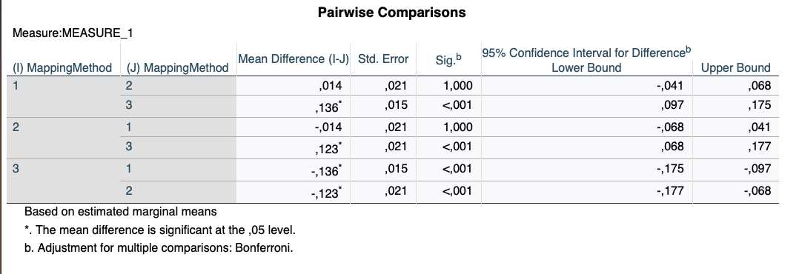
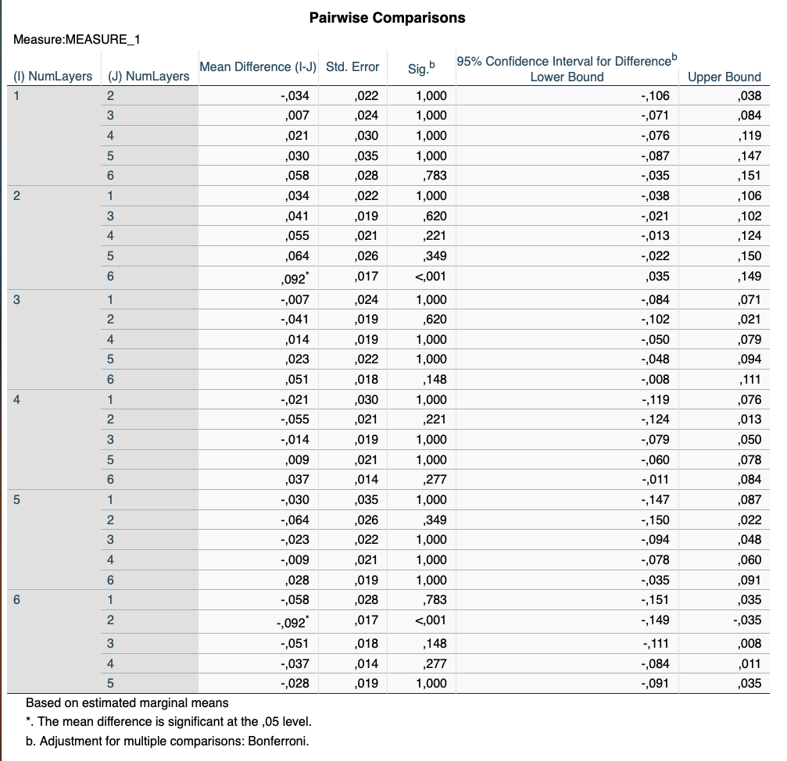
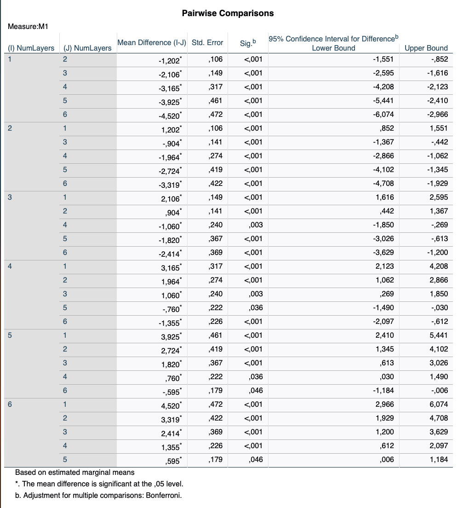
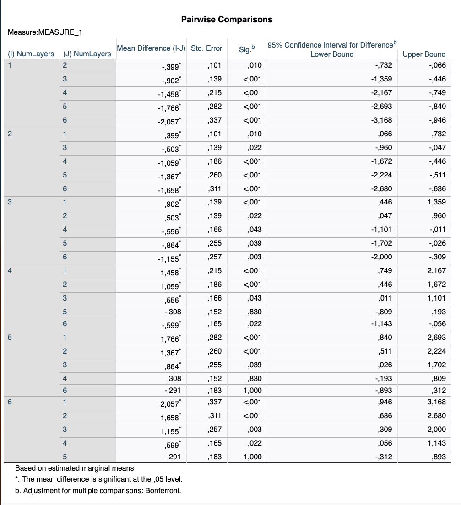

# Auswertung der Studienergebnisse

## Methodik

- within-subject Design

## Vorverarbeitung

- Entfernen initialer Phase vor der Interaktion (> 300 Frames) (betrifft 93 von 6210 aufgezeichneten Fällen)

## Einfluss von Anzahl und Anordung der Ebenen auf die Effektivität (korrekt gehaltene Ebenen)

- Die allgemeine Erfolgsrate über alle Probanden und Konditionen lag bei 0,7 (SD = 0,031, 95%-CI [0,635,0,765])

| Anzahl Ebenen | M     | SD    | 95%-CI         |
| ------------- | ----- | ----- | -------------- |
| 6             | 0,714 | 0,037 | [0,638, 0,790]  |
| 9             | 0,748 | 0,035 | [0,676, 0,820] |
| 12            | 0,707 | 0,038 | [0,627, 0,787] |
| 15            | 0,693 | 0,032 | [0,627, 0,759] |
| 18            | 0,684 | 0,034 | [0,615, 0,754] |
| 21            | 0,653 | 0,033 | [0,588, 0,724] |
| gesamt        | 0,700 | 0,031 | [0,635, 0,765] |

| Anordnung   | M     | SD    | 95%-CI         |
| ----------- | ----- | ----- | -------------- |
| komprimiert | 0,750 | 0,032 | [0,684, 0,816] |
| gleichmäßig | 0,737 | 0,038 | [0,659, 0,815] |
| gedehnt     | 0,614 | 0,030 | [0,551, 0,677] |
| gesamt      | 0,700 | 0,031 | [0,635, 0,765] |

- Analyse mittels einer zweifaktoriellen ANOVA mit Messwiederholung
- Soweit nicht anders angegeben, wird immer mit einem Signifikanz-Wert p < 0.001 gerechnet
- Der Mauchly-Test auf Spherizität war nicht siginifikant für die Anordnung (p = 0,166) und auch nicht für die Interaktion von Anordnung und Ebenenanzahl (p = 0,875), jedoch signifikant für die Ebenanzahl ( p = 0,007 )
- Für die Ebenananzahl wurden die Werte deswegen nach Greenhouse-Geisser (e=0,565) korrigiert
- Die Ebenenanordnung als Haupteffekt ist siginifikant mit F (2, 44) = 30,423, p < 0,001, np2 = 0,580
- Der paarweise Vergleich zeigt, dass der Unterschied zwischen komprimierter und gleichmäßiger Anordung nicht signifikant ist, dafür jedoch der Unterschied zwischen komprimierter und gleichmäßiger Anordnung zur gedehnten Anordnung

| Kombination               | F                | np2   | p       |
| ------------------------- | ---------------- | ----- | ------- |
| komprimiert - gleichmäßig | F(1,22) = 0,409  | 0,018 | 0,529   |
| komprimiert - gedehnt     | F(1,22) = 83,003 | 0,790 | < 0,001 |

- paarweise Vergleiche (Bonferroni-korrigiert):

- Die Ebenenanzahl ist ebenfalls signifikant, jedoch in geringerer Ausprägung. Nach Anwendung der Greenhouse-Geisser Korrektur: F(2,825, 62,148) = 3,617, p = 0,020, np2 = 0,141
- Der paarweise Vergleich zeigt jedoch lediglich 9 Ebenen und 21 Ebenen einen signifikanten Unterschied
- paarweise Vergleiche (Bonferroni-korrigiert):

## Einfluss von Anzahl und Anordnung der Ebenen auf die Effizienz (Dauer bis zur Zielerreichung)

- Die mittlere Dauer zur Erfüllung des Tasks betrug 8,441 Sekunden (SD: 0,259, 95-CI: [7,903, 8,979])

| Anzahl Ebenen | M      | SD    | 95%-CI          |
| ------------- | ------ | ----- | --------------- |
| 6             | 5,954  | 0,130 | [5,685, 6,224]  |
| 9             | 7,156  | 0,147 | [6,795, 7,518]  |
| 12            | 8,060  | 0,188 | [7,670, 8,451]  |
| 15            | 9,120  | 0,359 | [8,376, 9,864]  |
| 18            | 9,880  | 0,459 | [8,927, 10,833] |
| 21            | 10,475 | 0,477 | [9,485, 11,464] |
| gesamt        | 8,441  | 0,259 | [7,903, 8,979]  |

| Anordnung   | M     | SD    | 95%-CI         |
| ----------- | ----- | ----- | -------------- |
| komprimiert | 8,563 | 0,284 | [7,974, 9,153] |
| gleichmäßig | 8,268 | 0,252 | [7,746, 8,790] |
| gedehnt     | 8,491 | 0,295 | [7,878, 9,104] |
| gesamt      | 8,441 | 0,259 | [7,903, 8,979] |

- Analyse mittels einer zweifaktoriellen ANOVA mit Messwiederholung
- Soweit nicht anders angegeben, wird immer mit einem Signifikanz-Wert p < 0.001 gerechnet
- Für die Anzahl der Ebenen wurde eine Verletzung von der Spherizität festgestellt, die mittels Greenhouse-Geisser mit einem Wert e=0,282 korrigiert wurde.
- Die Anzahl der Ebenen als Haupteffekt war signifikant (F(1,411, 31,039) = 59,468, np2=0,73)
- Die Kontrastanalyse zeigt, dass der Effekt für alle Ebenen gilt, d.h. mit zunehmender Anzahl verwendeter Ebenen nimmt auch die Zeitdauer signifikant zu.

| Kombination | F                 | np2   | p       |
| ----------- | ----------------- | ----- | ------- |
| 6 - 9       | F(1,22) = 128,23  | 0,854 | < 0,001 |
| 6 - 12      | F(1,22) = 200,485 | 0,901 | < 0,001 |
| 6 - 15      | F(1,22) = 99,925  | 0,820 | < 0,001 |
| 6 - 18      | F(1,22) = 72,644  | 0,768 | < 0,001 |
| 6 - 21      | F(1,22) = 91,666  | 0,806 | < 0,001 |

- paarweise Vergleiche (Bonferroni-korrigiert):
  

- Die verschiedenen Ebenenanordungen unterschieden sich nicht signifikant (F(1,776, 39,063) = 1,602,  p = 0,216, np2 = 0.068)
- Die Interaktion zwischen Ebenenanzahl und -anordnung war ebenfalls nicht signifikant (F(3,987, 87,705) = 1,039, p = 0,392, np2 = 0,045)

## Einfluss von Anzahl und Anordnung der Ebenen auf die Wendepunkte

- Die durchschnittliche Anzahl an Wendepunkten über alle Probanden und Kondition betrug 2,898 (M = 0,186, 95%-CI = [2,513, 3,283])

| Anzahl Ebenen | M     | SD    | 95%-CI         |
| ------------- | ----- | ----- | -------------- |
| 6             | 1,801 | 0,085 | [1,624, 1,978] |
| 9             | 2,200 | 0,093 | [2,007, 2,393] |
| 12            | 2,703 | 0,166 | [2,359, 3,048] |
| 15            | 3,259 | 0,236 | [2,770, 3,748] |
| 18            | 3,567 | 0,312 | [2,91, 4,214]  |
| 21            | 3,858 | 0,364 | [3,104, 4,612] |
| gesamt        | 2,898 | 0,186 | [2,513, 3,283] |

| Anordnung   | M     | SD    | 95%-CI         |
| ----------- | ----- | ----- | -------------- |
| komprimiert | 2,961 | 0,172 | [2,604, 3,318] |
| gleichmäßig | 2,873 | 0,220 | [2,418, 3,329] |
| gedehnt     | 2,860 | 0,217 | [2,409, 3,311] |
| gesamt      | 2,898 | 0,186 | [2,513, 3,283] |

- Analyse mittels einer zweifaktoriellen ANOVA mit Messwiederholung
- Soweit nicht anders angegeben, wird immer mit einem Signifikanz-Wert p < 0.001 gerechnet
- Für die Anzahl der Ebenen wurde eine Verletzung von der Spherizität festgestellt, die mittels Greenhouse-Geisser mit einem Wert e=0,364 korrigiert wurde.
- Die Anzahl der Ebenen als Haupteffekt war signifikant (F(1,820, 40,046) = 26,552, np2=0,547)
- Die Kontrastanalyse zeigt, dass der Effekt für alle Ebenen gilt, d.h. mit zunehmender Anzahl verwendeter Ebenen nimmt auch die Zeitdauer signifikant zu.

| Kombination | F                 | np2   | p       |
| ----------- | ----------------- | ----- | ------- |
| 6 - 9       | F(1,22) = 15,561  | 0,414 | < 0,001 |
| 6 - 12      | F(1,22) = 42,392  | 0,658 | < 0,001 |
| 6 - 15      | F(1,22) = 45,810  | 0,676 | < 0,001 |
| 6 - 18      | F(1,22) = 39,363  | 0,641 | < 0,001 |
| 6 - 21      | F(1,22) = 37,157  | 0,628 | < 0,001 |

- Die Paarweisen Vergleiche (Bonferroni-korrigiert) zeigen signifikante Effekte für alle Ebenen-Kombinationen, außer 15 -18 und 18 - 21:

- Die verschiedenen Ebenenanordnungen unterschieden sich nicht signifikant (F(1,493, 32,840) = 0,279,  p = 0,694, np2 = 0.013)
- Die Interaktion zwischen Ebenenanzahl und -anordnung war ebenfalls nicht signifikant (F(4,262, 93,758) = 0,690, p = 0,610, np2 = 0,030)

## Einfluss von Anzahl und Anordnung der Ebenen Dauer bei fehlgeschlagenen Versuchen

